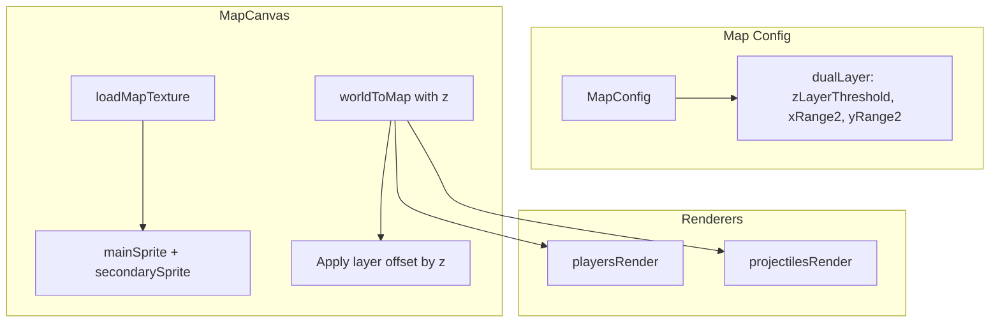

# 双层地图支持实现计划

## 需求摘要

- 支持双层地图（如 de_nuke）：主图左、辅图右，横排展示
- 资源配置：主图 `name.svg`，辅图 `name_2.svg`（PNG 降级同理）
- 坐标换算：每个底图用各自的 xRange/yRange 独立计算
- Z 轴分派：`z > zLayerThreshold` 显示主图，否则显示辅图（nuke 阈值为 -480）

## 架构概览




## 1. 配置层改动

**文件**: [frontend/src/config/map.ts](frontend/src/config/map.ts)

- 扩展 `MapConfig` 接口，增加可选字段：
  - `dualLayer?: { zLayerThreshold: number }` —— 标记双层地图及 z 阈值
  - `xRange2?: { start: number; end: number }` —— 辅图 x 范围（可选，缺省与主图相同）
  - `yRange2?: { start: number; end: number }` —— 辅图 y 范围（可选，缺省与主图相同）
- 新增辅助函数：
  - `getMapSvg2Url(mapName: string): string` → `/map/${mapName}_2.svg`
  - `isDualLayerMap(config: MapConfig): boolean`
- 修改 de_nuke 配置示例：

```ts
'de_nuke': {
  name: 'de_nuke',
  imageUrl: '/backGroundMap/de_nuke.png',
  leftSideGroundMap: '/leftSideGroundMap/de_nuke_left.png',
  width: 1024,
  height: 1024,
  xRange: { start: -3453, end: 3715 },
  yRange: { start: -4281, end: 2887 },
  dualLayer: { zLayerThreshold: -480 },
  // xRange2/yRange2 可选，若与主图相同可省略
},
```

- PNG 降级：辅图 URL 固定为 `/backGroundMap/${name}_2.png`，与主图 `imageUrl` 命名规则一致

## 2. useMapConfig 扩展

**文件**: [frontend/src/composables/useMapConfig.ts](frontend/src/composables/useMapConfig.ts)

- 增加 `mapRange2`（辅图范围），当未配置时使用主图 `mapRange`
- 增加 `isDualLayer`、`zLayerThreshold` 的派生值

## 3. MapCanvas 核心改动

**文件**: [frontend/src/components/ReplayPlayer/MapCanvas.vue](frontend/src/components/ReplayPlayer/MapCanvas.vue)

### 3.1 纹理加载

- `loadMapTexture()` 改为 `loadMapTexture(): Promise<{ main: Texture; secondary?: Texture; isSvg: boolean }>`
- 若为双层地图：同时加载 `name.svg` 与 `name_2.svg`，失败时分别降级到对应 PNG

### 3.2 地图布局

- 单层：沿用现有逻辑，`mapSprite` 为单个 Sprite
- 双层：`mapSprite` 改为 `Container`，内部为两个 Sprite：
  - 主图：`position.set(-mapSize/2, 0)`，anchor 0.5
  - 辅图：`position.set(mapSize/2, 0)`，anchor 0.5
- 双层时总宽度 `combinedWidth = 2 * mapSize`，`centerWorld` 和 `fitScale` 使用 `combinedWidth`

### 3.3 worldToMap 签名与逻辑

- 新签名：`worldToMap(x: number, y: number, z?: number): { x: number; y: number }`
- 单层：忽略 `z`，逻辑不变
- 双层：
  1. 判断层：`const onMainLayer = z === undefined || z > zLayerThreshold`
  2. 选择范围：主层用 `mapRange`，辅层用 `mapRange2`（或 `mapRange`）
  3. 按各自范围计算 `pixelX`, `pixelY`
  4. 偏移：主层 `finalX = -mapSize/2 + pixelX`，辅层 `finalX = mapSize/2 + pixelX`；`finalY = pixelY`

### 3.4 兼容性

- `worldToMap` 保持双参数调用兼容，第三参数 `z` 可选
- `mapSprite` 类型改为 `Sprite | Container | null`，`centerWorld` 中对 Container 使用 `getBounds()` 获取尺寸

## 4. 调用方传入 z

### 4.1 playersRender

**文件**: [frontend/src/composables/playersRender.ts](frontend/src/composables/playersRender.ts)

- `RenderContext.worldToMap` 类型改为 `(x: number, y: number, z?: number) => { x: number; y: number }`
- 调用处：`worldToMap(player.x, player.y, player.z)`（约第 395、455、490 行）

### 4.2 projectilesRender

**文件**: [frontend/src/composables/projectilesRender.ts](frontend/src/composables/projectilesRender.ts)

- `RenderContext.worldToMap` 与各函数签名中的 `worldToMap` 增加可选 `z` 参数
- 所有 `worldToMap(x, y)` 改为传入 `z`：
  - 投掷物：`proj.x, proj.y, proj.z`
  - 轨迹点：`cp.x, cp.y, cp.z`
  - 掉落道具：`eq.x, eq.y, eq.z`
  - C4：`bomb.x, bomb.y, bomb.z`
  - `calculatePixelRadius` 中用于计算缩放的距离时，需传入对应实体的 `z` 以便正确选择层

## 5. 轨迹线跨层

投掷物轨迹可能跨越上下层（如从地上扔到地下）。当前方案下，`worldToMap` 已按各点 `z` 返回在双层布局中的最终坐标，轨迹线直接连接这些点即可，无需额外逻辑。跨层时线段会自然横跨主辅图之间。

## 6. 边界情况

- `player.z` 或 `entity.z` 为 `undefined`：视为上层，使用主图（等价于 `z > threshold`）
- 仅 de_nuke 配置为双层，其余地图保持原逻辑
- 辅图资源缺失：若 `name_2.svg` 与 `/backGroundMap/name_2.png` 都失败，可降级为只显示主图并打日志

## 7. 资源准备

需确保存在：

- [frontend/public/map/de_nuke.svg](frontend/public/map/de_nuke.svg)
- [frontend/public/map/de_nuke_2.svg](frontend/public/map/de_nuke_2.svg)

（PNG 降级时需 `/backGroundMap/de_nuke_2.png`，当前 git 显示已有 `de_nuke.svg` 与 `de_nuke_2.svg`）

## 8. 实施顺序建议

1. 修改 map.ts 配置和辅助函数
2. 更新 useMapConfig
3. 修改 MapCanvas：loadMapTexture、布局、worldToMap
4. 更新 playersRender 的 worldToMap 调用
5. 更新 projectilesRender 的 worldToMap 调用
6. 手动测试 de_nuke 回放，验证主辅图显示和 z 分层是否正确

