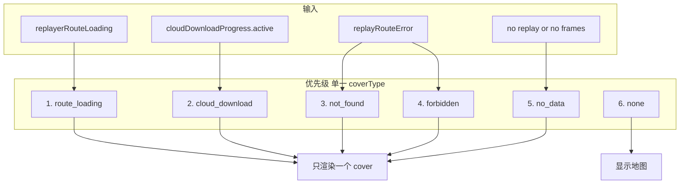

# 播放器 Cover 单一状态与优先级梳理

## 现状

当前有两处会显示“盖住”地图的界面：

1. **App.vue**：`replayer-loading-overlay`，条件 `replayerRouteLoading && !cloudDownloadProgress?.active`，文案「正在加载回放…」+ 转圈。
2. **ReplayPlayer.vue**：`empty-state`，条件 `!replay || !frames || frames.length === 0`，内部分支：
  - `cloudDownloadProgress?.active` → 「正在从云端下载回合」+ 进度条
  - `replayRouteError === 'not_found'` → 「未找到回放」
  - `replayRouteError === 'forbidden'` → 「回放无权限」
  - 否则 → 「暂无回放数据」

冲突来源：  

- 路由加载（`replayerRouteLoading`）与“无数据”状态（`暂无回放数据`）可能时序上交替出现，或逻辑上重叠（例如路由加载未结束时 ReplayPlayer 已渲染出“暂无回放数据”）。  
- 两处各自判断，没有统一的优先级，无法保证“永远最多显示一个 cover”。

## 目标

- 所有 cover 类型在一个地方按**固定优先级**决定。
- 任意时刻**至多显示一个** cover。
- 便于后续维护和扩展。

## 方案：单一 cover 类型 + 仅在 ReplayPlayer 内渲染

把“是否显示 cover”和“显示哪一种”都收口到 **ReplayPlayer**，由 ReplayPlayer 根据优先级计算出一个 `coverType`，只渲染对应的一块 UI。App 的 loading 遮罩去掉，改为通过 prop 或 provide 把“路由是否在加载”传给 ReplayPlayer，参与该优先级计算。

### 1. Cover 类型与优先级（固定顺序）

建议的优先级（从高到低，命中即显示、且只显示这一种）：

| 优先级 | 类型             | 条件                                 | 文案/表现                    |
| --- | -------------- | ---------------------------------- | ------------------------ |
| 1   | route_loading  | `replayerRouteLoading === true`    | 「正在加载回放…」+ 转圈（与现 App 一致） |
| 2   | cloud_download | `cloudDownloadProgress?.active`    | 「正在从云端下载回合」+ 进度条         |
| 3   | not_found      | `replayRouteError === 'not_found'` | 「未找到回放」+ 图标              |
| 4   | forbidden      | `replayRouteError === 'forbidden'` | 「回放无权限」+ 图标              |
| 5   | no_data        | 上面都不满足且 `!replay                   |                          |
| -   | none           | 有 `replay` 且 `frames.length > 0`   | 不显示 cover，显示地图           |

说明：

- “暂无回放数据”仅作为**最低优先级**的兜底：只有在「不是路由加载、不是云端下载、没有 not_found/forbidden 错误」时，且当前确实没有可展示的 replay/frames 时才显示，避免与“正在加载”混淆。
- 同一时刻只会有一个条件成立为“展示用”的 cover，保证永远最多一个。

### 2. 数据流与实现要点

- **ReplayPlayer 需要拿到 `replayerRouteLoading**`  
  - 在 [App.vue](frontend/src/App.vue) 中通过 `provide('replayerRouteLoading', replayerRouteLoading)` 提供（或给 `<ReplayPlayer>` 传 prop `:route-loading="replayerRouteLoading"`）。  
  - 在 [ReplayPlayer.vue](frontend/src/components/ReplayPlayer/ReplayPlayer.vue) 中 `inject` 或接收 prop。
- **ReplayPlayer 内计算单一 cover 类型**  
  - 使用一个 `computed`，例如 `coverType`，按上表顺序判断（先 `replayerRouteLoading`，再 `cloudDownloadProgress?.active`，再 `replayRouteError`，最后 `no_data`）。  
  - 仅当 `coverType !== 'none'` 时渲染一层 cover 容器；容器内用 `v-if` / 单块内容按 `coverType` 渲染对应文案和样式（转圈 / 进度条 / 未找到 / 无权限 / 暂无回放数据）。  
  - 不再使用“先总 empty-state 再内部分支”的多重分支，避免与“暂无回放数据”和“正在加载”同时存在或闪烁。
- **App.vue 移除 loading 遮罩**  
  - 删除或注释掉 `replayer-loading-overlay` 的整块（`replayerRouteLoading && !cloudDownloadProgress?.active` 的那块）。  
  - “正在加载回放…” 的展示完全由 ReplayPlayer 的 `coverType === 'route_loading'` 负责，样式可复用或迁移现有 overlay 的样式到 ReplayPlayer。
- **样式**  
  - 将 App 里 `.replayer-loading-overlay` / `.replayer-loading-modal` / 转圈等样式迁移到 ReplayPlayer，或抽成共用 class，保证「正在加载回放…」在 ReplayPlayer 内与当前 overlay 视觉一致。  
  - 保持现有「未找到」「无权限」「暂无回放数据」「云端下载」的样式不变，仅改为由 `coverType` 驱动。

### 3. 逻辑示意（Mermaid）

### 4. 涉及文件

- [frontend/src/App.vue](frontend/src/App.vue)：去掉 `replayer-loading-overlay`；对 ReplayPlayer 提供 `replayerRouteLoading`（provide 或 prop）。
- [frontend/src/components/ReplayPlayer/ReplayPlayer.vue](frontend/src/components/ReplayPlayer/ReplayPlayer.vue)：  
  - 接收 `replayerRouteLoading`；  
  - 新增 `coverType` computed（按上表优先级）；  
  - 模板改为「仅当 `coverType !== 'none'` 时渲染一个 cover 容器，内部按 `coverType` 渲染对应一种状态」；  
  - 如需可迁移/复用 App 的 loading 样式到本组件。

按上述实现后，“暂无回放数据”与“正在加载回放…”不会同时出现，且永远最多只显示一个 cover。