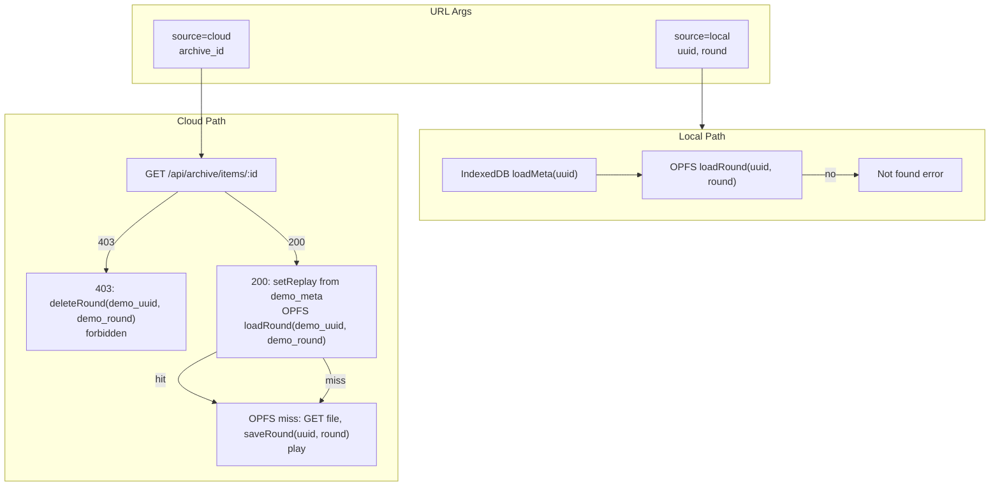

# Replayer 按 source 参数简化加载逻辑

## 目标

- **本地录像**：`source=local&uuid=xxx&round=N`，只走 IndexedDB meta + OPFS uuid 路径，找不到即报错。
- **云录像**：`source=cloud&archive_id=xxx`，先 GET item 判权，无权限则清本地泄露并报无权限；有权限则用 item 的 meta，看 OPFS 的 **uuid 路径**（item.demo_uuid），有则播，无则拉取到该 uuid 路径再播。

## 1. URL 约定与兼容

| 来源  | 参数                              | 说明                                |
| --- | ------------------------------- | --------------------------------- |
| 本地  | `source=local&uuid=xxx&round=N` | 必填 uuid；round 默认 1                |
| 云   | `source=cloud&archive_id=xxx`   | 一条 archive 对应一个回合，round 由 item 决定 |

兼容：若未带 `source` 但有 `uuid`，视为 `source=local`，保证旧链接可用。若带 `archive_id` 且无 `source`，可视为 `source=cloud`。

## 2. 后端改动

**文件：[pkg/archive/handler.go](pkg/archive/handler.go)**

- **GET /api/archive/items/:id（取单条 meta，不取 file）**
  - 当前：必须登录且 `item.OwnerID == u.ID` 才 200。
  - 改为：与 wantFile 一致，用 **canViewArchiveItem(u, item)** 判断。允许未登录访问 public item。
  - 200：`writeJSONOK(w, itemToMap(item))`。
  - 403：返回 body 便于前端清缓存，例如  
  `writeJSON(w, 403, map[string]interface{}{"status":"ERROR","error":"no permission","archive_id":item.ID,"demo_uuid":item.DemoUUID,"demo_round":item.DemoRound})`  
  这样前端可据此删除 OPFS 下 `(demo_uuid, demo_round)` 的缓存。
- PATCH/DELETE 仍仅允许 owner，逻辑不变。

## 3. 前端 OPFS：按回合删除

**文件：[frontend/src/composables/opfs-storage.ts](frontend/src/composables/opfs-storage.ts)**

- 新增 **deleteRound(uuid: string, roundNum: number): Promisevoid**：
  - 在 `replays/{uuid}/` 下删除 `round_{roundNum}.pb`（若存在则 removeEntry，NotFound 可忽略）。
- 用于：云 403 时按 403 返回的 demo_uuid、demo_round 清理单回合缓存，避免泄露。

## 4. 前端路由与入口：按 source 分支

**文件：[frontend/src/App.vue](frontend/src/App.vue)**

- **ensureReplayerRouteData** 中从 query 读取：`source`、`uuid`、`round`、`archive_id`。
  - 若 `source === 'cloud'` 或仅有 `archive_id`：走云分支（见下）。
  - 否则（含缺省、`source=local`、或仅有 `uuid`）：走本地分支。
- **本地分支**（source=local）：
  - 必须有 `uuid`；round 默认 1。
  - 调用新方法：**loadReplayByLocal(uuid, round)**（见 useReplayData）。
  - 不再在此处调用原来的 `loadReplayById` + `loadRoundData` 的“先云后本地”混合逻辑。
- **云分支**（source=cloud）：
  - 必须有 `archive_id`。
  - 调用新方法：**loadReplayByCloud(archiveId)**（见 useReplayData）。
- 云列表点击：**goToArchiveItem(item)** 改为跳转  
`navigate('/replayer', 'source=cloud&archive_id=' + encodeURIComponent(item.id))`，不再带 uuid/round。

## 5. useReplayData：两种加载入口

**文件：[frontend/src/composables/useReplayData.ts](frontend/src/composables/useReplayData.ts)**

### 5.1 本地：loadReplayByLocal(uuid, roundNumber)

- 清空 `replayRouteError`。
- IndexedDB：`loadMeta(uuid)`；无 meta 则 `replayRouteError = 'not_found'`，return。
- 用 meta 做 adaptMeta，得到 replay meta；**setReplayData(meta + 占位 frames)**（或先不设 frames，等回合加载）。
- OPFS：`loadRound(uuid, roundNumber)`；无则 `replayRouteError = 'not_found'`，return。
- 解码 round，设置 frames/bounds/currentRoundNumber。
- 不请求任何云接口。

### 5.2 云：loadReplayByCloud(archiveId)

- 清空 `replayRouteError`。
- **GET /api/archive/items/:archive_id**（credentials: include）。
  - **403**：解析 body 的 `demo_uuid`、`demo_round`；若有则调用 OPFS **deleteRound(demo_uuid, demo_round)**；`replayRouteError = 'forbidden'`，return。
  - **404**：`replayRouteError = 'not_found'`，return。
  - **200**：解析 `data` 得到 item（含 demo_uuid, demo_round, demo_meta 等）。
- 用 **item.demo_meta**（JSON）构造/适配为 ReplayData 的 meta 部分（mapName、teamCT、teamT、uuid 用 item.demo_uuid 等），**setReplayData**（replay 来自 item，无 IndexedDB）。
- OPFS：**loadRound(item.demo_uuid, item.demo_round)**。
  - 有：解码并设置 frames/bounds/currentRoundNumber，结束。
  - 无：**GET /api/archive/file?demo_uuid=...&demo_round=...**，带进度；将响应保存到 **saveRound(item.demo_uuid, item.demo_round, bytes)**（即 uuid 路径，不是 cloud_xxx）；再解码并设置 frames/bounds/currentRoundNumber。

保留并复用的辅助：**applyRoundBytes**、**fetchRoundFileFromCloud**（或内联一次）。云分支不再使用 `cloud`_ 前缀存储。

### 5.3 loadRoundData 与 loadReplayById 的收敛

- **loadReplayById(uuid)**：仅用于“从本地库选 demo 后进 replayer”的本地场景，内部可改为调用 **loadReplayByLocal(uuid, 1)**，或保留为仅拉 meta+round1 的封装。
- **loadRoundData**：在 replayer 内切换回合时使用。需区分来源：
  - 若当前是 **source=local**（可由 URL 或一个 ref 如 `replayerSourceRef` 得知）：只做 OPFS loadRound(uuid, roundNumber)，无则 not_found。
  - 若当前是 **source=cloud**：当前设计下一个 archive 只有单回合，切换 round 可能不适用；若仍需支持，可约定云只读 item.demo_round，或后续再扩展“按 archive_id + round”的接口。此处可先实现为：云模式下 loadRoundData 仅当 round === item.demo_round 时从 OPFS/网络取，否则视为无效或保持当前帧。

为简化，**ensureReplayerRouteData** 只根据 URL 的 source 调用 loadReplayByLocal 或 loadReplayByCloud；round 切换仅在 local 模式下由 loadRoundData 使用。

## 6. ReplayPlayer 内 URL 同步

**文件：[frontend/src/components/ReplayPlayer/ReplayPlayer.vue](frontend/src/components/ReplayPlayer/ReplayPlayer.vue)、[frontend/src/components/ReplayPlayer/TimelineControl.vue](frontend/src/components/ReplayPlayer/TimelineControl.vue)（若在此处改 URL）**

- 当前：切 round 时 `replaceLocation('/replayer', 'uuid=...&round=...')`。
- 改为：若为本地源，保留并同步 `source=local&uuid=xxx&round=N`；若为云源，保持 `source=cloud&archive_id=xxx`（不随 round 变，因云单条即单回合）。
- 需要把 **当前 source（及 archive_id 或 uuid）** 通过 provide/inject 或 props 传给 ReplayPlayer，以便生成正确的 search。

## 7. 清理与废弃

- 移除或简化原 **loadRoundData** 中“先 GET item by demo_uuid+demo_round、再 cloud_ 缓存”的混合逻辑；由 loadReplayByLocal / loadReplayByCloud 完全按 source 分支替代。
- 不再使用 **cloud_** 前缀目录；云拉取的文件统一存 **replays/{demo_uuid}/round_{demo_round}.pb**。
- **loadAllReplays** / **cleanupOrphanedReplays** 中此前对 `cloud`_ 的保留逻辑可删除（不再有 cloud_ 目录）。

## 8. 数据流示意

## 9. 实现顺序建议

1. 后端：GET items/:id 按 canViewArchiveItem 返回 200/403，403 带 demo_uuid、demo_round。
2. OPFS：实现 deleteRound(uuid, roundNum)。
3. useReplayData：实现 loadReplayByLocal、loadReplayByCloud；收敛 loadReplayById/loadRoundData 与 URL source 的对应关系。
4. App.vue：ensureReplayerRouteData 读 source/archive_id，分支调用 loadReplayByLocal 或 loadReplayByCloud；goToArchiveItem 改为 source=cloud&archive_id=xxx。
5. ReplayPlayer：同步 URL 时带上 source（及 uuid 或 archive_id），云源保持 archive_id。
6. 移除 cloud_ 相关逻辑与废弃分支。

