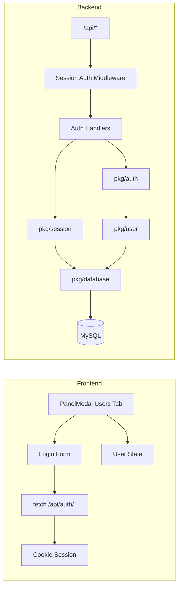

# 用户登录系统实现计划

## 现状摘要

- **前端**：`[frontend/src/components/Settings/PanelModal.vue](frontend/src/components/Settings/PanelModal.vue)` 中「用户管理」Tab 目前仅占位文案「暂未上线 Coming Soon...」；项目无现成 API 客户端，可用 `fetch` + 同源相对路径（如 `/api/...`）请求。
- **后端**：`[cmd/server/main.go](cmd/server/main.go)` 仅提供静态与页面路由，无 `/api` 路由；`[cmd/server/utils](cmd/server/utils/)` 仅有限流等中间件；`[pkg/](pkg/)` 下仅有 demoinfocs、engine，无数据库或用户相关封装；`[go.mod](go.mod)` 未引入 GORM 与 MySQL 驱动。

## 架构概览

---

## 一、数据库与 pkg 封装（后端）

### 1. 依赖

- 在 `go.mod` 中新增：`gorm.io/gorm`、`gorm.io/driver/mysql`（以及 `github.com/go-sql-driver/mysql` 若 GORM 未自动拉取）。

### 2. 环境变量与 DSN

- 使用你提供的：`SNOWBO_DB_URL`、`SNOWBO_DB_PORT`、`SNOWBO_DB_USER`、`SNOWBO_DB_PASSWD`。
- DSN 需包含 database name：若未提供，需增加 `**SNOWBO_DB_NAME**`（如 `demobox`），拼接为：  
`user:passwd@tcp(url:port)/dbname?charset=utf8mb4&parseTime=True`。

### 3. 新建 pkg 与表结构

| 包路径            | 职责                                                                                     |
| -------------- | -------------------------------------------------------------------------------------- |
| `pkg/database` | 从环境变量读取配置、建立 MySQL 连接、返回 `*gorm.DB`；可选 `AutoMigrate` 入口，供 main 调用。                     |
| `pkg/user`     | 用户模型与存储：查/创用户、按用户名查、更新最后登录时间；密码由上层（如 auth）哈希后写入。                                       |
| `pkg/session`  | Session 模型与存储：创建/删除/按 SessionID 查询；过期清理可选后续再做。                                         |
| `pkg/auth`     | 登录逻辑：校验用户名密码（bcrypt）、创建 session、写 cookie；登出：删 session、清 cookie；提供「从 request 取当前用户」的辅助。 |

**用户表（GORM 模型）** 建议字段：

- `ID`：主键（自增）
- `UID`：业务唯一标识，八位随机大写字母+数字（如 `A1B2C3D4`），创建时生成，唯一索引
- `Username`：用户名，唯一索引，用于登录
- `Email`：邮箱，可空，可选唯一
- `Phone`：手机号，可空，可选唯一
- `PasswordHash`：bcrypt 哈希，非空
- `CreatedAt`、`UpdatedAt`：GORM 标准
- `LastLoginAt`：最后登录时间，可空
- `Status`（启用/禁用）
- `DeletedAt`（软删）

**Session 表** 建议字段：

- `ID` 主键
- `SessionID`（或 `Token`）：唯一，写入 cookie
- `UserID` 外键关联用户
- `ExpiresAt`、`CreatedAt`

SessionID 建议使用随机字符串（如 32 字节 hex），Cookie 名如 `session_id`，HttpOnly、SameSite=Lax、Path=/。

### 4. 表初始化

- 在 `pkg/database` 的迁移逻辑中对 `User`、`Session` 做 `db.AutoMigrate(&User{}, &Session{})`。
- 在 `main.go` 启动时：若 DB 配置存在则连接并执行上述迁移；若未配置则可不连 DB，且可禁用或跳过需要 DB 的 API（按你偏好二选一：不配置则整个服务不启或仅 API 返回 503）。

---

## 二、API 与路由（后端）

### 1. 路由与中间件

- 在 `cmd/server/main.go` 中：
  - 为 API 挂载前缀 `/api`，与现有静态/页面路由区分（先匹配 `/api`，再走静态）。
  - 使用 `pkg/session`（或 `pkg/auth`）提供的 **Session 中间件**：对需要登录的接口从 Cookie 取 SessionID，查 DB 得到 User，注入到 context 或 request；未登录则 401。
- 建议的 API 设计（均 JSON）：

| 方法   | 路径                 | 说明                                                                       | 是否需要登录         |
| ---- | ------------------ | ------------------------------------------------------------------------ | -------------- |
| POST | `/api/auth/login`  | Body: `{"username","password"}`；成功则 Set-Cookie + 返回用户摘要（如 uid, username） | 否              |
| POST | `/api/auth/logout` | 清除服务端 session + 清除 cookie                                                | 否（有 cookie 则清） |
| GET  | `/api/auth/me`     | 返回当前登录用户摘要；未登录 401                                                       | 是（Session 中间件） |

- 登录成功时在 `pkg/user` 中更新该用户的 `LastLoginAt`。

### 2. 错误与响应格式

- 统一 JSON 结构，例如：`{ "ok": bool, "data": {...}, "error": "message" }`。
- 登录失败：400/401 + error 文案；未登录访问 `/api/auth/me`：401。

---

## 三、前端（PanelModal Users Tab）

### 1. UI 行为

- 替换「暂未上线 Coming Soon...」为**用户区**：
  - **未登录**：展示登录表单——用户名、密码两个输入框（复用现有 `.input-group`、`.ds-input`、`.input-label` 等样式），提交按钮；错误时在表单下方显示错误信息。
  - **已登录**：展示当前用户名（或 UID）、以及「退出登录」按钮。
- 进入「用户管理」Tab 时，调用 `GET /api/auth/me`（`credentials: 'include'`）以恢复登录状态；未登录则保持表单展示。

### 2. 请求方式

- 使用 `fetch(url, { method, headers: { 'Content-Type': 'application/json' }, body, credentials: 'include' })`，不引入 axios。
- Base URL 使用相对路径 `/api/...`（与当前页同源）。

### 3. 状态

- 使用 `ref`：如 `user`（当前用户信息或 null）、`loginError`、`loading`（登录中/拉取 me 中），在 script 中维护即可，无需全局 store（若后续要跨组件再用可再抽 composable）。

---

## 四、安全与实现细节

- 密码：仅存储 bcrypt 哈希，不做明文；登录时用 `golang.org/x/crypto/bcrypt` 校验。
- Cookie：SessionID 存于 HttpOnly Cookie，减少 XSS 窃取；SameSite=Lax，Path=/。
- Session 过期：建议在 `pkg/session` 中设置 `ExpiresAt`（如 7 天），校验时若过期则当未登录并删除该 session；可选定时任务清理过期记录。
- 生产环境建议 HTTPS，Cookie 可考虑 `Secure`。

---

## 五、文件与目录变更清单

| 类型  | 路径                                                | 说明                                                                      |
| --- | ------------------------------------------------- | ----------------------------------------------------------------------- |
| 依赖  | `go.mod`                                          | 添加 gorm、mysql driver、bcrypt                                             |
| 新建  | `pkg/database/database.go`                        | 环境变量、DSN、GORM 连接、AutoMigrate                                            |
| 新建  | `pkg/user/model.go`                               | User 模型                                                                 |
| 新建  | `pkg/user/store.go`                               | 按用户名查、创建、更新 LastLoginAt 等                                               |
| 新建  | `pkg/session/model.go`                            | Session 模型                                                              |
| 新建  | `pkg/session/store.go`                            | 创建/删除/按 SessionID 查                                                     |
| 新建  | `pkg/session/middleware.go`                       | 从 Cookie 取 Session、注入 User 的 HTTP 中间件                                   |
| 新建  | `pkg/auth/handler.go`                             | Login / Logout / Me 的 HTTP Handler，依赖 user + session                    |
| 新建  | `pkg/auth/password.go`                            | bcrypt Hash/Compare                                                     |
| 修改  | `cmd/server/main.go`                              | 挂载 `/api`、初始化 DB、注册 auth 路由与 Session 中间件                                |
| 修改  | `frontend/src/components/Settings/PanelModal.vue` | 用户 Tab 登录表单、已登录态、调用 `/api/auth/login`、`/api/auth/logout`、`/api/auth/me` |

---

## 六、可选与后续

- **首次运行无用户**：不实现注册时，可在迁移后插入一个默认管理员（环境变量或固定账号，仅当用户数为 0 时插入），或你本地手动 INSERT；若需要「注册」接口可再加 `POST /api/auth/register`。
- **UID 生成**：在 `pkg/user` 或 `pkg/auth` 中写一个 8 位 `[A-Z0-9]` 随机串，保证与现有 UID 不重复再写入。
- 数据库名：若你希望不新增环境变量，可约定 `SNOWBO_DB_URL` 为 `host/dbname` 或单独增加 `SNOWBO_DB_NAME`，在计划实现时二选一即可。

以上为完整用户登录系统实现计划，按此可实现「PanelModal Users Tab 用户名+密码登录 + 后端 Session + MySQL 用户表」的闭环。