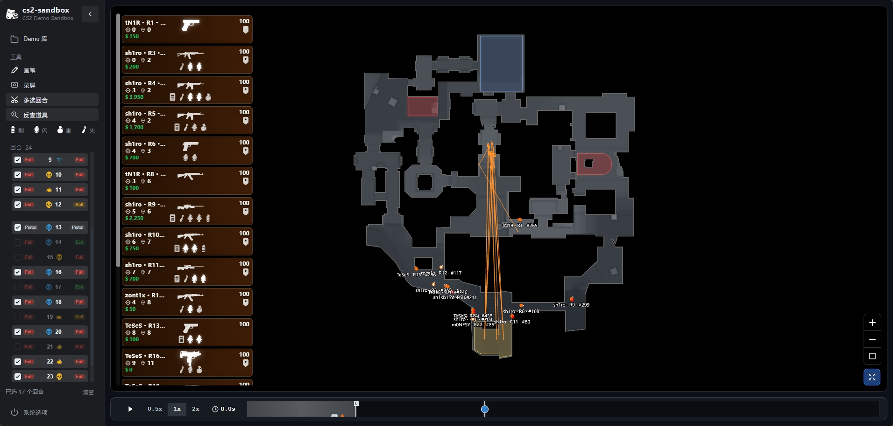
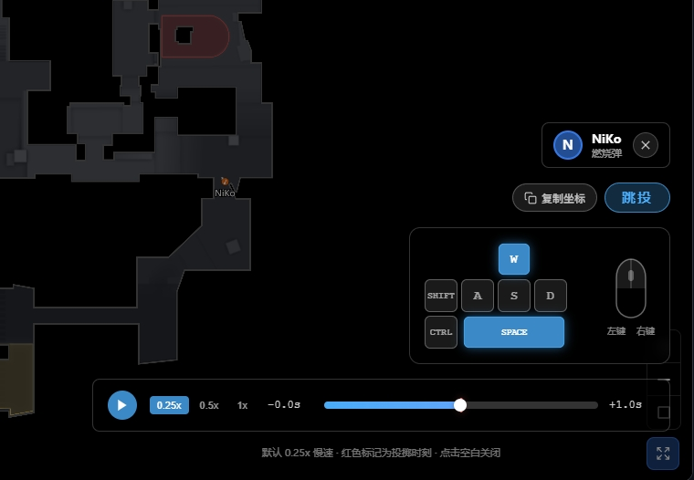
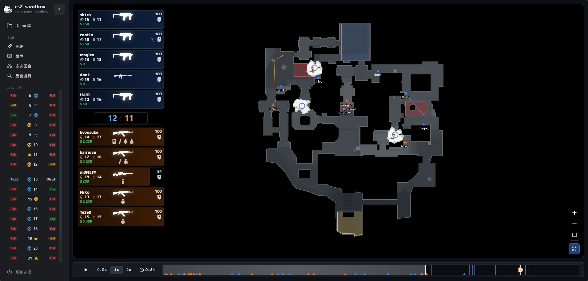

# cs2-sandbox

  

CS2 Demo 复盘与分析沙盒

`cs2-sandbox` 是一个免安装的 Windows 小工具。双击 EXE，在浏览器中打开本地回放工作台，选择 `.dem` 文件即可开始复盘。Demo 不会上传，所有解析、播放和缓存都在你的电脑上完成。

## 开始使用

1. 下载 [cs2-sandbox-v0.0.2.exe](https://github.com/bugkingZHT/cs2-sandbox/releases/download/v0.0.2/cs2-sandbox-v0.0.2.exe)。
2. 在“Demo 库”点击“解析 DEMO”，粘贴本机 `.dem` 的完整路径。
3. 解析完成后选择回合，进入 2D 播放器复盘。

首次运行无需安装，也不需要登录。已经解析的回放会保存在本机；关闭后再次打开仍可直接播放。

## 从落点反查每一颗道具

想知道一颗烟、闪、火或雷是怎么落到目标位置的，不必逐回合拖动时间轴。选择道具类型和目标区域，cs2-sandbox 会在选中的回合中找出符合条件的投掷，并将出手、飞行轨迹与落点集中呈现。

- 按烟雾弹、闪光弹、燃烧弹和手雷筛选，缩小到想研究的落点区域。
- 跨多个回合并排查看同一位置的不同丢法，快速比较队伍默认、临场变招和关键补道具。
- 一键过滤无关玩家，保留投掷者、轨迹和关键时刻。

## 逐帧动作分析，复刻每一次投掷

点击空中飞行的道具，进入出手前后的一段逐帧分析。按键面板会同步显示移动、跳跃、蹲下和鼠标操作，自动标注跳投、蹲投、跳蹲投、走投或站投，让投掷动作一眼可读。

- 查看投掷瞬间的位置、视角和操作节奏，避免只复刻落点却错过动作细节。
- 复制坐标与视角指令，在跑图服务器开启 `sv_cheats 1` 后即可快速回到对应点位练习。
- 对照慢放进度条，确认起跳、出手与落地的准确时机。

## 全局回合视角，定位战术窗口

在同一张 2D 地图上同步查看十名玩家、击杀、投掷物、C4 和时间轴。按地图、队伍、玩家与经济局类型筛选回合，使用隐藏玩家、缩放、画笔、截图与片段录制，把分析范围收敛到真正关键的战术窗口。

## 完全本地

- 不上传 Demo，不需要账号或网络服务。
- 原始 `.dem` 文件不会被移动或删除。
- 解析后的回放库和缓存保存在 `%LOCALAPPDATA%\cs2-sandbox\`。
- 重复点击 EXE 只会唤起已有工具，不会启动多个本地服务。

## 版本

当前版本：`v0.0.2` · Windows x64

修复道具解析模式下新版 Demo 的玩家按键状态缺失问题。已解析的旧缓存需要重新解析源 `.dem` 文件才能补齐按键数据。
