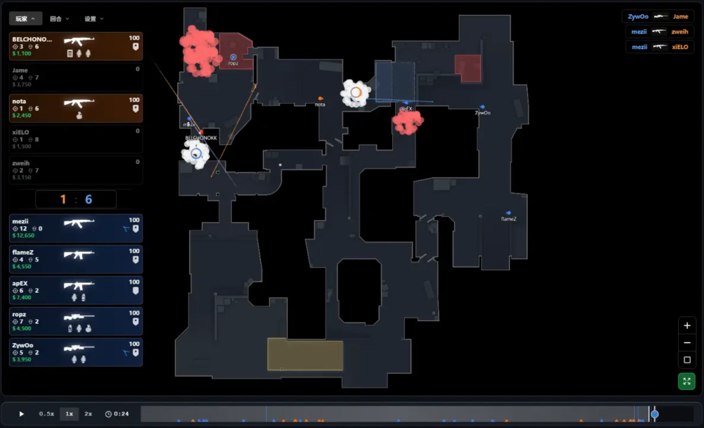
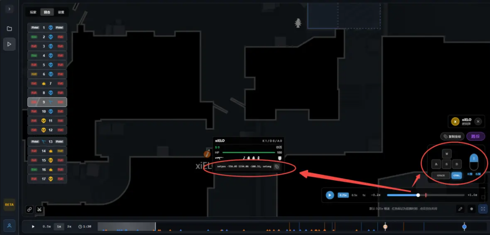

# cs2-sandbox

  

你的 CS2 本地 Demo 复盘沙盒

`cs2-sandbox` 是一个免安装的 Windows 小工具：双击 EXE，在浏览器中打开本地回放工作台，选择 `.dem` 文件即可开始复盘。Demo 不会上传，所有解析、播放和缓存都在你的电脑上完成。

## 开始使用

1. 下载并双击 [cs2-sandbox-v0.0.2.exe](release/cs2-sandbox-v0.0.2.exe)。
2. 在“Demo 库”点击“解析 DEMO”，粘贴本机 `.dem` 的完整路径。
3. 解析完成后选择回合，进入 2D 播放器复盘。

首次运行无需安装，也不需要登录。已经解析的回放会保存在本机；关闭后再次打开仍可直接播放。

## 自由筛选回放，复盘更精准

精准筛选单回合回放，一键隐藏无关玩家视角，随心开关界面功能，把注意力留给真正关键的战术。

- 按地图、队伍、玩家与经济局类型筛选比赛和回合。
- 在 2D 地图上同步查看十名玩家、击杀、投掷物、C4 与时间轴。
- 使用纯净模式、玩家隐藏、缩放与画笔，把视野聚焦到一个战术细节。
- 快捷截图、片段录制和导演剪辑，精彩对局与关键战术随时留存。

## 快速解析道具丢法

点击空中飞行的道具图标即可进入道具解析模式，逐帧查看出手时的按键操作、玩家位置与瞄点动作坐标。

复制对应指令后，在跑图服务器开启 `sv_cheats 1`，即可直接粘贴并复刻职业选手或高分玩家的投掷点位。深挖道具技巧，不用反复猜测路线和节奏。

## 完全本地

- 不上传 Demo，不需要账号或网络服务。
- 原始 `.dem` 文件不会被移动或删除。
- 解析后的回放库和缓存保存在 `%LOCALAPPDATA%\cs2-sandbox\`。
- 重复点击 EXE 只会唤起已有工具，不会启动多个本地服务。

## 版本

当前版本：`v0.0.2` · Windows x64

修复道具解析模式下新版 Demo 的玩家按键状态缺失问题。已解析的旧缓存需要重新解析源 `.dem` 文件才能补齐按键数据。
