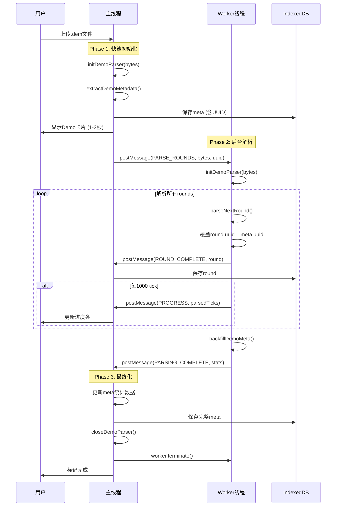

# Web Worker 解析架构

## 概述

Demo文件解析采用主线程 + Worker线程混合架构，将耗时的round解析移至Worker，避免UI阻塞。

## 核心原理

- **主线程**：负责轻量级操作（初始化parser、提取metadata、backfill后处理）
- **Worker线程**：负责重量级操作（遍历所有rounds、逐tick解析帧数据）

## 三阶段流程



## 消息协议

### 主线程 → Worker

```typescript
{
  type: 'PARSE_ROUNDS',
  demoBytes: Uint8Array,      // Demo文件字节
  uuid: string,                // 主线程生成的UUID
  estimatedTotalTicks: number  // 预估总tick数
}
```

### Worker → 主线程

#### 1. 进度更新（每1000 tick）
```typescript
{
  type: 'PROGRESS',
  parsedTicks: number  // 已解析tick数
}
```

#### 2. Round完成（每个round）
```typescript
{
  type: 'ROUND_COMPLETE',
  round: ReplayRound  // 包含frames、uuid等
}
```

#### 3. 解析完成
```typescript
{
  type: 'PARSING_COMPLETE',
  totalRounds: number,
  scoreCT: number,
  scoreT: number,
  teamCT: string,
  teamT: string
}
```

#### 4. 错误
```typescript
{
  type: 'ERROR',
  error: string
}
```

## UUID对齐机制

**问题**：Worker中重新初始化parser会生成新UUID，导致rounds与meta的UUID不匹配。

**解决**：
1. 主线程Phase 1提取metadata时获得UUID
2. 主线程将UUID传给Worker
3. Worker解析每个round后**强制覆盖** `round.uuid = uuid`
4. 确保所有数据使用同一UUID存储在IndexedDB

## 统计数据回刷

Worker完成解析后调用`backfillDemoMeta()`获取最终统计：
- `totalRounds`：总回合数
- `scoreCT / scoreT`：双方比分
- `teamCT / teamT`：队伍名称（从GameState提取）

主线程接收后直接更新meta并保存，无需二次调用Go函数。

## 性能特性

| 指标 | 优化前（主线程） | 优化后（Worker） |
|------|----------------|-----------------|
| UI响应 | 冻结30-60秒 | 始终流畅 |
| 卡片显示 | 解析完成后 | 1-2秒内显示 |
| 进度更新 | 实时（高频） | 每1000 tick（低频） |
| 并发支持 | 阻塞后续上传 | 支持多文件同时解析 |

## 文件结构

```
workers/
├── wasm-parser.worker.ts   # Worker实现
└── README.md               # 本文档

composables/
└── useReplayData.ts        # 主线程调用逻辑
```

## 关键代码位置

- **Worker创建**：`useReplayData.ts:481`
- **消息处理**：`useReplayData.ts:485-566`
- **Worker启动**：`useReplayData.ts:569-574`
- **UUID覆盖**：`wasm-parser.worker.ts:139`
- **Tick进度**：`wasm-parser.worker.ts:119-127`
- **统计回刷**：`wasm-parser.worker.ts:159-166`

## 错误处理

- Worker初始化失败 → 发送ERROR消息 → 标记demo为failed
- 解析过程出错 → worker.onerror触发 → 清理资源
- 主线程异常 → finally块确保worker.terminate()
