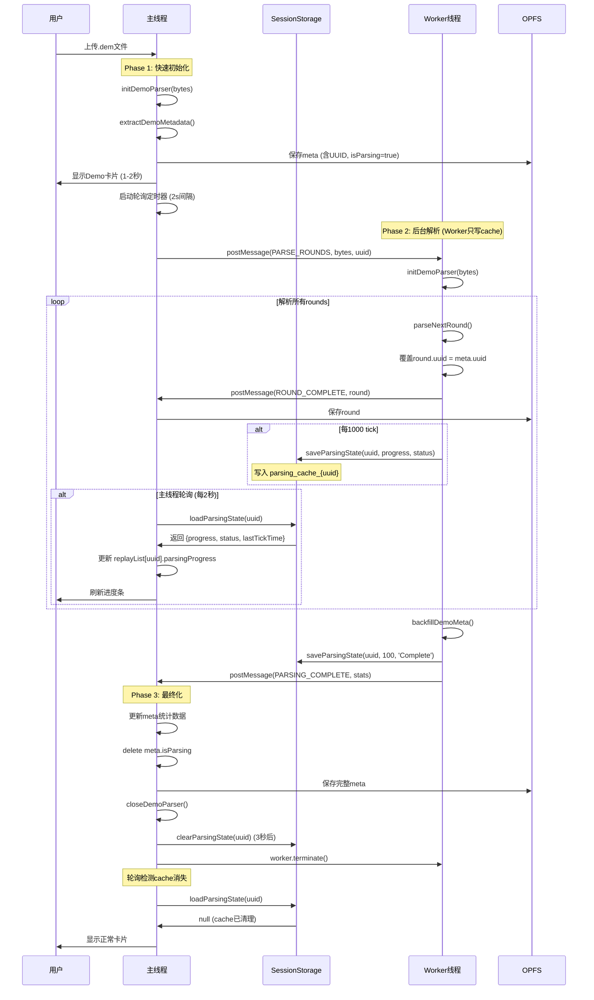

# Web Worker 解析架构

## 概述

Demo文件解析采用主线程 + Worker线程混合架构，将耗时的round解析移至Worker，避免UI阻塞。

**核心设计原则**：Worker 只写缓存，主线程定时轮询缓存更新 UI。

## 核心原理

- **主线程**：负责轻量级操作（初始化parser、提取metadata、backfill后处理）、定时轮询缓存更新进度条
- **Worker线程**：负责重量级操作（遍历所有rounds、逐tick解析帧数据）、写入解析进度到 sessionStorage
- **Cache层**：sessionStorage 作为主线程和 Worker 的解耦通信层

## 架构图

```
┌─────────────┐         ┌──────────────────┐         ┌─────────────┐
│   Worker    │         │  sessionStorage  │         │  主线程UI    │
│   线程      │         │   (Cache层)      │         │             │
└─────────────┘         └──────────────────┘         └─────────────┘
       │                         │                          │
       │ 1. 写进度               │                          │
       │ saveParsingState()      │                          │
       │────────────────────────>│                          │
       │                         │                          │
       │                         │   2. 定时轮询 (2s)       │
       │                         │   loadParsingState()     │
       │                         │<─────────────────────────│
       │                         │                          │
       │                         │   3. 更新 replayList     │
       │                         │   demo.parsingProgress   │
       │                         │─────────────────────────>│
       │                         │                          │
       │ 4. 解析完成             │                          │
       │ clearParsingState()     │                          │
       │────────────────────────>│                          │
       │                         │                          │
       │                         │   5. 轮询检测cache消失   │
       │                         │   显示正常卡片           │
       │                         │<─────────────────────────│
```

## 三阶段流程



## Cache-Polling 架构

### Cache 数据结构

```typescript
// Cache Key: parsing_cache_{uuid}
interface ParsingStateCache {
  uuid: string;
  progress: number;        // 0-100
  status: string;          // "Parsing rounds..."
  lastTickTime: number;    // 最后一次tick的时间戳 (用于超时检测)
}
```

### Worker 职责：只写 Cache

```typescript
// Worker 中的进度更新
const updateDemoParsingProgress = (uuid: string, progress: number, status: string) => {
  // 只保存到 cache，不触碰 replayList
  saveParsingState(uuid, progress, status);
  console.log(`[UpdateProgress] [${uuid}] Saved to cache: ${progress}%, ${status}`);
};
```

**调用时机**：
- PROGRESS 消息：`updateDemoParsingProgress(uuid, progress, "Parsing rounds...")`
- ROUND_COMPLETE：`updateDemoParsingProgress(uuid, 97, "Finalizing metadata...")`
- PARSING_COMPLETE：`updateDemoParsingProgress(uuid, 100, "Complete")`

### 主线程职责：轮询 Cache 更新 UI

```typescript
// 启动轮询 (每 2 秒)
startIncompleteMonitoring() {
  incompleteCheckInterval = setInterval(() => {
    checkIncompleteDemosTimeout();
  }, 2000);
}

// 轮询逻辑
checkIncompleteDemosTimeout() {
  const cachedUUIDs = getAllCachedUUIDs();
  
  replayList.value.forEach(demo => {
    if (cachedUUIDs.includes(demo.uuid) && !demo.hasFailed) {
      const cachedState = loadParsingState(demo.uuid);
      
      if (cachedState) {
        if (isParsingTimedOut(cachedState)) {
          // 超时 → 标记失败
          demo.hasFailed = true;
          demo.parsingStatus = 'Parsing timeout...';
          clearParsingState(demo.uuid);
        } else {
          // 未超时 → 更新进度
          demo.parsingProgress = cachedState.progress;
          demo.parsingStatus = cachedState.status;
        }
      } else {
        // Cache 无效 → 清理
        clearParsingState(demo.uuid);
      }
    }
  });
}
```

### 超时检测逻辑

```typescript
// 基于 cache 的 lastTickTime 判断超时
const isParsingTimedOut = (cache: ParsingStateCache): boolean => {
  const timeSinceLastTick = Date.now() - cache.lastTickTime;
  return timeSinceLastTick > PARSER_CONFIG.workerTickTimeout; // 默认 30000ms
};
```

## 消息协议

### 主线程 → Worker

```typescript
{
  type: 'PARSE_ROUNDS',
  demoBytes: Uint8Array,      // Demo文件字节
  uuid: string,                // 主线程生成的UUID
  estimatedTotalTicks: number  // 预估总tick数
}
```

### Worker → 主线程

#### 1. 进度更新（每1000 tick）
```typescript
{
  type: 'PROGRESS',
  uuid: string,        // 新增：UUID 用于 1v1 绑定
  parsedTicks: number  // 已解析tick数
}
```

**主线程处理**：
- ✅ 更新 `lastTickTime`（用于 tick timeout 检测）
- ✅ 调用 `updateDemoParsingProgress()` 写入 cache
- ❌ **不再直接更新 `replayList`**

#### 2. Round完成（每个round）
```typescript
{
  type: 'ROUND_COMPLETE',
  round: ReplayRound  // 包含frames、uuid等
}
```

**主线程处理**：
- 保存 round 到 OPFS
- 写入 cache（97%，"Finalizing metadata..."）

#### 3. 解析完成
```typescript
{
  type: 'PARSING_COMPLETE',
  totalRounds: number,
  scoreCT: number,
  scoreT: number,
  teamCT: string,
  teamT: string,
  roundResults: RoundResultInfo[]
}
```

**主线程处理**：
- Backfill meta（删除 `isParsing`、`originalFilePath`）
- 保存完整 meta 到 OPFS
- 写入 cache（100%，"Complete"）
- **3秒后清理 cache**（让轮询有机会看到 100%）
- 轮询检测到 cache 消失 → 显示正常卡片

#### 4. 错误
```typescript
{
  type: 'ERROR',
  uuid: string,  // 新增：UUID 用于 1v1 绑定
  error: string
}
```

**主线程处理**：
- ✅ 清理 cache：`clearParsingState(uuid)`
- ❌ **不再直接更新 `replayList`**
- ⏱️ 轮询会检测到 cache 消失 + 超时 → 标记为失败

## 卡片渲染的 4 步逻辑

页面加载时（`loadAllReplays()`）：

```typescript
// Step 1: 构建 Meta UUID Map
const metaMap = new Map<string, ReplayMeta>();
metas.forEach(meta => metaMap.set(meta.uuid, meta));

// Step 2: 提取 Cache 中所有 UUID
const cachedUUIDs = getAllCachedUUIDs();
const cacheSet = new Set(cachedUUIDs);

// Step 3: 判断交集与孤立缓存
const intersection = cachedUUIDs.filter(uuid => metaMap.has(uuid));
const orphanCaches = cachedUUIDs.filter(uuid => !metaMap.has(uuid));

// 清理孤立缓存（仅在 cache，不在 meta）
orphanCaches.forEach(uuid => clearParsingState(uuid));

// Step 4: 渲染卡片
replayList.value = Array.from(metaMap.values()).map(meta => {
  const hasCache = cacheSet.has(meta.uuid);
  
  if (hasCache) {
    // UUID 在 cache + meta → 显示进度条（从 cache 读取）
    const cachedState = loadParsingState(meta.uuid);
    if (isParsingTimedOut(cachedState)) {
      return { ...meta, hasFailed: true, parsingProgress: cache.progress };
    } else {
      return { ...meta, parsingProgress: cache.progress, parsingStatus: cache.status };
    }
  } else {
    // UUID 仅在 meta → 正常展示
    return { ...meta };
  }
});
```

## UUID对齐机制

**问题**：Worker中重新初始化parser会生成新UUID，导致rounds与meta的UUID不匹配。

**解决**：
1. 主线程Phase 1提取metadata时获得UUID
2. 主线程将UUID传给Worker
3. Worker解析每个round后**强制覆盖** `round.uuid = uuid`
4. 确保所有数据使用同一UUID存储在OPFS
5. Cache key 也使用相同 UUID：`parsing_cache_{uuid}`

## 统计数据回刷

Worker完成解析后调用`backfillDemoMeta()`获取最终统计：
- `totalRounds`：总回合数
- `scoreCT / scoreT`：双方比分
- `teamCT / teamT`：队伍名称（从GameState提取）
- `roundResults`：每回合胜负结果

主线程接收后直接更新meta并保存，无需二次调用Go函数。

同时删除临时字段：
```typescript
delete meta.originalFilePath;
delete meta.isParsing;
```

## 性能特性

| 指标 | 优化前（主线程） | 优化后（Worker + Cache） |
|------|----------------|------------------------|
| UI响应 | 冻结30-60秒 | 始终流畅 |
| 卡片显示 | 解析完成后 | 1-2秒内显示 |
| 进度更新 | 实时（高频阻塞） | 轮询（2s间隔，非阻塞） |
| 并发支持 | 阻塞后续上传 | 支持多文件同时解析 |
| 刷新恢复 | 丢失进度 | 自动恢复进度 |
| 架构耦合 | Worker直接操作UI | 完全解耦（通过cache） |

## 失败检测机制

### 1. Tick Timeout 检测（主动）

Worker 端每次发送 PROGRESS 时更新 `lastTickTime`：
```typescript
// Worker 中
saveParsingState(uuid, progress, status); // 自动更新 lastTickTime
```

主线程轮询检测超时：
```typescript
// 主线程中（每 2 秒）
if (isParsingTimedOut(cachedState)) {
  // 30秒内没有 tick → 超时
  demo.hasFailed = true;
  clearParsingState(uuid);
}
```

### 2. Cache 消失检测（被动）

当 Worker 发生错误或主动清理 cache 时：
```typescript
// Worker 错误处理
worker.onerror = () => {
  clearParsingState(uuid); // 清理 cache
  // 不直接修改 replayList
};

// 主线程轮询检测
if (!cachedState && meta.isParsing) {
  // Cache 消失但 meta 仍标记为 parsing → 异常
  demo.hasFailed = true;
}
```

## 文件结构

```
workers/
├── wasm-parser.worker.ts   # Worker实现（只写cache）
└── README.md               # 本文档

composables/
├── useReplayData.ts        # 主线程调用逻辑（轮询cache）
└── opfs-storage.ts         # OPFS 存储接口

config/
└── parser.ts               # PARSER_CONFIG.workerTickTimeout
```

## 关键代码位置

### 主线程
- **Worker创建**：`useReplayData.ts:635`
- **轮询启动**：`useReplayData.ts:272` (`startIncompleteMonitoring`)
- **轮询逻辑**：`useReplayData.ts:283` (`checkIncompleteDemosTimeout`)
- **4步渲染**：`useReplayData.ts:163-259` (`loadAllReplays`)
- **Cache工具**：`useReplayData.ts:41-96`

### Worker
- **UUID覆盖**：`wasm-parser.worker.ts:139`
- **Tick进度**：`wasm-parser.worker.ts:119-127`
- **统计回刷**：`wasm-parser.worker.ts:159-166`

### Cache操作
- **写入cache**：`useReplayData.ts:41` (`saveParsingState`)
- **读取cache**：`useReplayData.ts:55` (`loadParsingState`)
- **超时检测**：`useReplayData.ts:70` (`isParsingTimedOut`)
- **清理cache**：`useReplayData.ts:77` (`clearParsingState`)
- **获取所有UUID**：`useReplayData.ts:89` (`getAllCachedUUIDs`)

## 错误处理

| 错误场景 | Worker 行为 | 主线程行为 | 结果 |
|---------|-----------|----------|------|
| Worker初始化失败 | 发送ERROR消息 | 清理cache | 轮询检测超时→失败卡片 |
| 解析过程出错 | worker.onerror触发 | 清理cache | 轮询检测超时→失败卡片 |
| Tick超时(30s) | - | 清理cache | 轮询检测超时→失败卡片 |
| 主线程异常 | - | finally块确保terminate() | Cache自然过期 |
| 页面刷新 | - | 轮询恢复进度 | 继续显示进度条 |

**关键原则**：Worker 和错误处理都**不直接修改 `replayList`**，只操作 cache，由轮询统一处理 UI 更新。

## 日志示例

```
[UpdateProgress] [abc-123] Saved to cache: 0%, Starting...
[IncompleteMonitor] Started monitoring (polling cache every 2s)

[UpdateProgress] [abc-123] Saved to cache: 15%, Parsing rounds...
[IncompleteMonitor] Poll: 1 checked, 1 updated, 0 timed out, 0 cache invalid

[UpdateProgress] [abc-123] Saved to cache: 30%, Parsing rounds...
[IncompleteMonitor] Poll: 1 checked, 1 updated, 0 timed out, 0 cache invalid

[UpdateProgress] [abc-123] Saved to cache: 100%, Complete
[ParseDemo] Cleared cache for abc-123
[IncompleteMonitor] Poll: 0 checked, 0 updated, 0 timed out, 0 cache invalid
```
