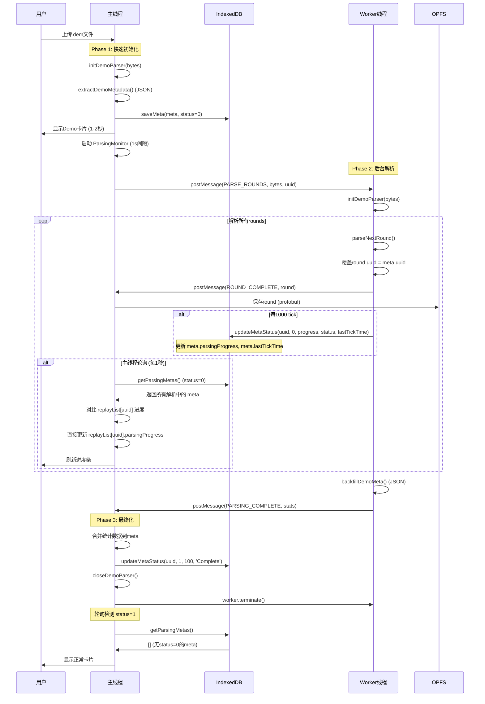

# Web Worker 解析架构

## 概述

Demo文件解析采用主线程 + Worker线程混合架构，将耗时的round解析移至Worker，避免UI阻塞。

**核心设计原则**：Worker 写 IndexedDB meta，主线程定时轮询 IndexedDB 更新 UI。

## 核心原理

- **主线程**：负责轻量级操作（初始化parser、提取metadata、backfill后处理）、定时轮询 IndexedDB 更新进度条
- **Worker线程**：负责重量级操作（遍历所有rounds、逐tick解析帧数据）、更新解析进度到 IndexedDB
- **IndexedDB**：统一存储 meta 数据，包含解析进度和状态字段

## 架构图

```
┌─────────────┐         ┌──────────────────┐         ┌─────────────┐
│   Worker    │         │    IndexedDB     │         │  主线程UI    │
│   线程      │         │   (Meta Store)   │         │             │
└─────────────┘         └──────────────────┘         └─────────────┘
       │                         │                          │
       │ 1. 更新进度              │                          │
       │ updateMetaStatus()      │                          │
       │────────────────────────>│                          │
       │                         │                          │
       │                         │   2. 定时轮询 (1s)       │
       │                         │   getParsingMetas()      │
       │                         │<─────────────────────────│
       │                         │                          │
       │                         │   3. 更新 replayList     │
       │                         │   demo.parsingProgress   │
       │                         │─────────────────────────>│
       │                         │                          │
       │ 4. 解析完成             │                          │
       │ updateMetaStatus(1)     │                          │
       │────────────────────────>│                          │
       │                         │                          │
       │                         │   5. 轮询检测status=1    │
       │                         │   显示正常卡片           │
       │                         │<─────────────────────────│
```

## 三阶段流程



## IndexedDB Meta 架构

### Meta 数据结构

```typescript
interface ReplayMeta {
  // 基础字段
  uuid: string;
  fileName: string;
  uploadTime: number;
  
  // 解析状态字段（新架构）
  status: number;              // 0=parsing, 1=complete, -1=failed
  parsingProgress: number;     // 0-100
  parsingStatus: string;       // "Parsing rounds..." / "Complete" / 错误信息
  lastTickTime: number;        // 最后一次tick的时间戳 (用于超时检测)
  
  // 游戏统计（backfill后填充）
  totalRounds: number;
  scoreCT: number;
  scoreT: number;
  teamCT: string;
  teamT: string;
  roundResults: RoundResultInfo[];
}
```

### IndexedDB Indexes

```typescript
// metaStore 索引
- uploadTime (排序、分页)
- status (快速查询 status=0 的解析中demos)
```

### Worker 职责：写 IndexedDB

```typescript
// Worker 中的进度更新
const updateProgress = async (uuid: string, progress: number, status: string) => {
  const metaStorage = await getMetaStorage();
  await metaStorage.updateMetaStatus(
    uuid,
    0,           // status = 0 (parsing)
    progress,    // 0-100
    status,      // "Parsing rounds..."
    Date.now()   // lastTickTime
  );
  console.log(`[Worker] [${uuid}] Progress: ${progress}%, ${status}`);
};
```

**调用时机**：
- 每 1000 tick：`updateProgress(uuid, progress, "Parsing rounds...")`
- Round 完成：`updateProgress(uuid, 97, "Finalizing metadata...")`
- 解析完成：`updateMetaStatus(uuid, 1, 100, "Complete")`

### 主线程职责：轮询 IndexedDB 更新 UI

```typescript
// 启动轮询 (每 1 秒)
startParsingMonitor() {
  parsingMonitorInterval = setInterval(() => {
    checkParsingDemos();
  }, 1000);
}

// 轮询逻辑
async checkParsingDemos() {
  const metaStorage = await getMetaStorage();
  const parsingMetas = await metaStorage.getParsingMetas(); // 查询 status=0
  
  for (const meta of parsingMetas) {
    const timeSinceLastTick = Date.now() - (meta.lastTickTime || 0);
    const demoIndex = replayList.value.findIndex(d => d.uuid === meta.uuid);
    
    if (demoIndex === -1) continue;
    
    // 1. 超时检测
    if (timeSinceLastTick > PARSER_CONFIG.workerTickTimeout) {
      await metaStorage.updateMetaStatus(uuid, -1, meta.parsingProgress, 'Timeout');
      needsReload = true;
      continue;
    }
    
    // 2. 检查完成状态
    if (meta.status === 1) {
      needsReload = true;
      continue;
    }
    
    // 3. 进度更新 - 直接从 meta 同步到 UI
    if (currentDemo.parsingProgress !== meta.parsingProgress) {
      replayList.value[demoIndex] = {
        ...currentDemo,
        parsingProgress: meta.parsingProgress,
        parsingStatus: meta.parsingStatus,
        lastTickTime: meta.lastTickTime,
      };
    }
  }
}
```

### 超时检测逻辑

```typescript
// 基于 meta.lastTickTime 判断超时
const timeSinceLastTick = Date.now() - meta.lastTickTime;
if (timeSinceLastTick > PARSER_CONFIG.workerTickTimeout) {
  // 超时 → 标记为失败 (status = -1)
  await metaStorage.updateMetaStatus(uuid, -1, meta.parsingProgress, 'Parsing timeout');
}
```

## 消息协议

### 主线程 → Worker

```typescript
{
  type: 'PARSE_ROUNDS',
  demoBytes: Uint8Array,      // Demo文件字节
  uuid: string,                // 主线程生成的UUID
  estimatedTotalTicks: number  // 预估总tick数
}
```

### Worker → 主线程

#### 1. 进度更新（每1000 tick）
```typescript
{
  type: 'PROGRESS',
  uuid: string,        // UUID 用于 1v1 绑定
  parsedTicks: number  // 已解析tick数
}
```

**主线程处理**：
- ✅ 更新 IndexedDB：`updateMetaStatus(uuid, 0, progress, status, Date.now())`
- ❌ **不再直接更新 `replayList`**（由轮询统一处理）

#### 2. Round完成（每个round）
```typescript
{
  type: 'ROUND_COMPLETE',
  round: ReplayRound  // 包含frames、uuid等
}
```

**主线程处理**：
- 编码为 protobuf
- 保存 round 到 OPFS
- 更新 IndexedDB（97%，"Finalizing metadata..."）

#### 3. 解析完成
```typescript
{
  type: 'PARSING_COMPLETE',
  totalRounds: number,
  scoreCT: number,
  scoreT: number,
  teamCT: string,
  teamT: string,
  roundResults: RoundResultInfo[]
}
```

**主线程处理**：
- Backfill meta（合并统计数据）
- 更新 IndexedDB：`updateMetaStatus(uuid, 1, 100, 'Complete')`
- 轮询检测到 status=1 → 重新加载列表 → 显示正常卡片

#### 4. 错误
```typescript
{
  type: 'ERROR',
  uuid: string,
  error: string
}
```

**主线程处理**：
- ✅ 更新 IndexedDB：`updateMetaStatus(uuid, -1, progress, errorMsg)`
- ❌ **不再直接更新 `replayList`**
- ⏱️ 轮询会检测到 status=-1 → 标记为失败

## 卡片渲染逻辑

页面加载时（`loadAllReplays()`）：

```typescript
// Step 1: 从 IndexedDB 加载所有 meta
const metas = await metaStorage.loadAllMetas();

// Step 2: 直接映射 meta 到 replayList（status 已包含解析状态）
replayList.value = metas.map(meta => ({
  ...meta,
  id: meta.uuid,
  frames: [],
  timestamp: meta.uploadTime,
}));

// Step 3: 启动 ParsingMonitor（自动处理 status=0 的卡片）
startParsingMonitor();
```

**卡片显示逻辑**（在 DemoLibrary.vue）：
```vue
<div class="demo-card" :class="{
  'is-parsing': demo.status === 0,
  'is-failed': demo.status === -1
}">
  <!-- status=0: 显示进度条覆盖层 -->
  <div v-if="demo.status === 0" class="parsing-overlay">
    <progress :value="demo.parsingProgress" max="100"></progress>
    <span>{{ demo.parsingStatus }}</span>
  </div>
  
  <!-- status=-1: 显示失败覆盖层 -->
  <div v-else-if="demo.status === -1" class="failed-overlay">
    <span>{{ demo.parsingStatus }}</span>
  </div>
  
  <!-- status=1: 正常显示卡片内容 -->
  <template v-else>
    <!-- 正常卡片内容 -->
  </template>
</div>
```

## UUID对齐机制

**问题**：Worker中重新初始化parser会生成新UUID，导致rounds与meta的UUID不匹配。

**解决**：
1. 主线程Phase 1提取metadata时获得UUID
2. 主线程将UUID传给Worker
3. Worker解析每个round后**强制覆盖** `round.uuid = uuid`
4. 确保所有数据使用同一UUID存储
   - Meta: IndexedDB `metaStore` (key = uuid)
   - Rounds: OPFS `/replay_data/{uuid}/round_{N}.pb`

## 统计数据回刷

Worker完成解析后调用`backfillDemoMeta()`获取最终统计（JSON格式）：
- `totalRounds`：总回合数
- `scoreCT / scoreT`：双方比分
- `teamCT / teamT`：队伍名称（从GameState提取）
- `roundResults`：每回合胜负结果

主线程接收后直接合并到meta并更新 IndexedDB，无需二次调用Go函数。

## 性能特性

| 指标 | 优化前（sessionStorage） | 优化后（IndexedDB） |
|------|----------------------|-------------------|
| UI响应 | 始终流畅 | 始终流畅 |
| 卡片显示 | 1-2秒内显示 | 1-2秒内显示 |
| 进度更新 | 轮询（2s间隔） | 轮询（1s间隔，更快） |
| 数据持久化 | 需要双写（OPFS protobuf + sessionStorage） | 单一存储（IndexedDB JSON） |
| 刷新恢复 | 需要 OPFS protobuf 读取 | 直接从 IndexedDB 读取 |
| 查询性能 | 遍历所有 meta 文件 | 索引查询（status=0） |
| 架构耦合 | Cache-Polling 双层 | 单层存储，直接轮询 |

## 失败检测机制

### 1. Tick Timeout 检测（主动）

Worker 端每次发送 PROGRESS 时更新 `lastTickTime`：
```typescript
// Worker 中（通过主线程转发）
await metaStorage.updateMetaStatus(uuid, 0, progress, status, Date.now());
```

主线程轮询检测超时：
```typescript
// ParsingMonitor 中（每 1 秒）
const timeSinceLastTick = Date.now() - meta.lastTickTime;
if (timeSinceLastTick > PARSER_CONFIG.workerTickTimeout) {
  // 30秒内没有 tick → 超时，标记为失败
  await metaStorage.updateMetaStatus(uuid, -1, meta.parsingProgress, 'Parsing timeout');
}
```

### 2. Status 状态检测（直接）

```typescript
// ParsingMonitor 中
const parsingMetas = await metaStorage.getParsingMetas(); // 只查询 status=0

// 完成检测
if (meta.status === 1) {
  // 重新加载列表 → 显示正常卡片
}

// 失败检测
if (meta.status === -1) {
  // 重新加载列表 → 显示失败覆盖层
}
```

## 文件结构

```
workers/
├── wasm-parser.worker.ts   # Worker实现（通过主线程写IndexedDB）
└── README.md               # 本文档

composables/
├── useReplayData.ts        # 主线程调用逻辑（ParsingMonitor）
├── opfs-storage.ts         # OPFS 存储接口（仅存储 rounds protobuf）
└── indexdb-storage.ts      # IndexedDB 存储接口（存储 meta JSON）

config/
└── parser.ts               # PARSER_CONFIG.workerTickTimeout
```

## 关键代码位置

### 主线程
- **Worker创建**：`useReplayData.ts:parseDemo()`
- **ParsingMonitor启动**：`useReplayData.ts:startParsingMonitor()`
- **轮询逻辑**：`useReplayData.ts:checkParsingDemos()`
- **列表加载**：`useReplayData.ts:loadAllReplays()`
- **IndexedDB操作**：`composables/opfs-storage.ts:MetaStorage`

### Worker
- **UUID覆盖**：`wasm-parser.worker.ts` (ROUND_COMPLETE消息处理)
- **Tick进度**：`wasm-parser.worker.ts` (PROGRESS消息发送)
- **统计回刷**：`wasm-parser.worker.ts` (backfillDemoMeta调用)

### IndexedDB操作
- **保存meta**：`metaStorage.saveMeta(meta, status)`
- **更新状态**：`metaStorage.updateMetaStatus(uuid, status, progress, statusMsg, lastTickTime)`
- **查询解析中**：`metaStorage.getParsingMetas()` (status=0索引查询)
- **加载所有**：`metaStorage.loadAllMetas()` (按uploadTime排序)

## 错误处理

| 错误场景 | Worker 行为 | 主线程行为 | IndexedDB 状态 | 结果 |
|---------|-----------|----------|--------------|------|
| Worker初始化失败 | 发送ERROR消息 | updateMetaStatus(-1) | status=-1 | 轮询检测→失败卡片 |
| 解析过程出错 | worker.onerror触发 | updateMetaStatus(-1) | status=-1 | 轮询检测→失败卡片 |
| Tick超时(30s) | - | updateMetaStatus(-1) | status=-1 | 轮询检测→失败卡片 |
| 主线程异常 | - | finally块确保terminate() | status保持0 | 页面刷新后继续轮询 |
| 页面刷新 | - | 重新启动ParsingMonitor | status=0持久化 | 继续显示进度条 |

**关键原则**：Worker 通过主线程更新 IndexedDB，ParsingMonitor 统一处理 UI 更新。

## 日志示例

```
[ParsingMonitor] Started monitoring (every 1s)
[Worker] [abc-123] Progress: 0%, Starting...

[Worker] [abc-123] Progress: 15%, Parsing rounds...
[ParsingMonitor] [abc-123] 进度: 15%, Parsing rounds...

[Worker] [abc-123] Progress: 30%, Parsing rounds...
[ParsingMonitor] [abc-123] 进度: 30%, Parsing rounds...

[Worker] [abc-123] Progress: 97%, Finalizing metadata...
[ParsingMonitor] [abc-123] 进度: 97%, Finalizing metadata...

[ParseDemo] Backfill complete, updating meta to status=1
[ParsingMonitor] 1 完成, 0 超时，重新加载列表
[ParsingMonitor] Stopped monitoring
```

## 架构对比总结

### 旧架构（sessionStorage Cache）
```
Worker → sessionStorage (cache) → 轮询 → replayList → UI
         ↓
    OPFS (meta protobuf + rounds protobuf)
```

### 新架构（IndexedDB）
```
Worker → 主线程 → IndexedDB (meta JSON) → 轮询 → replayList → UI
                 ↓
            OPFS (rounds protobuf only)
```

**关键改进**：
1. ✅ **单一数据源**：Meta 只存在于 IndexedDB（JSON），无需 sessionStorage 缓存
2. ✅ **索引查询**：`status` 索引快速查询解析中的 demos
3. ✅ **更快轮询**：1秒间隔（vs 2秒）
4. ✅ **数据持久化**：IndexedDB 自动持久化，刷新后直接读取
5. ✅ **简化架构**：去除 Cache-Polling 双层，直接轮询 IndexedDB
